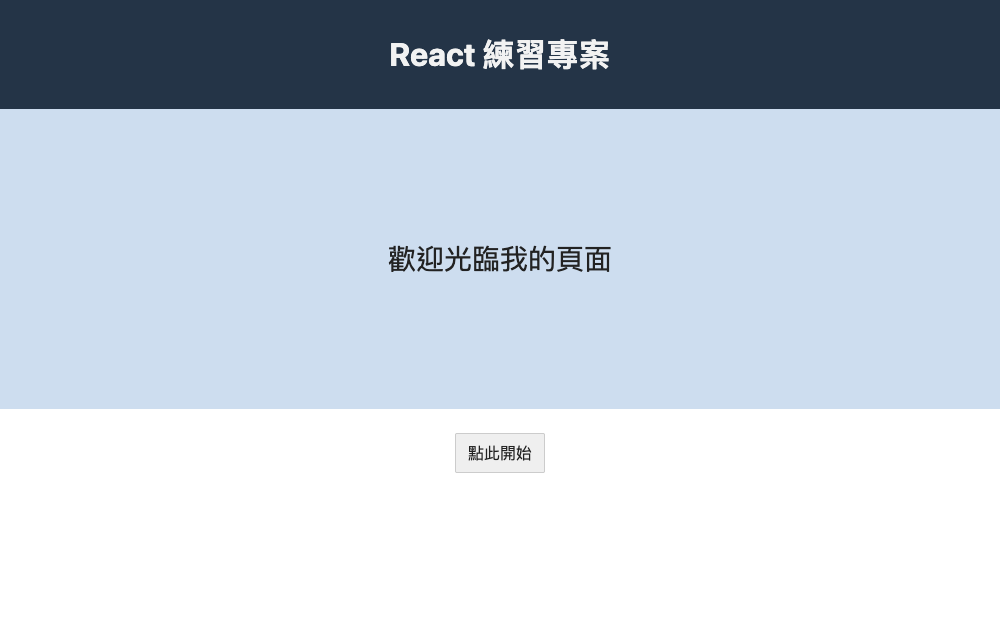
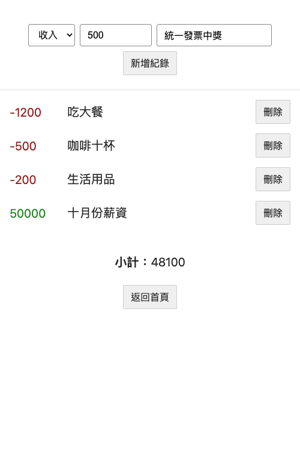

# 零基礎教學：用 Next.js 做記帳小工具，並自動部署到 Vercel

> 給完全沒寫過 React 的人。照順序做，每一步都會告訴你「打什麼、點哪裡、應該看到什麼」。
> 本文的程式碼都在本機實際跑過：ESLint、TypeScript、13 個單元測試、production build 全部通過，畫面截圖也是實際執行的結果。

---

## 目錄

0. [你會做出什麼](#0-你會做出什麼)
1. [先看懂這些名詞](#1-先看懂這些名詞)
2. [安裝工具](#2-安裝工具)
3. [建立專案](#3-建立專案)
4. [React 只要先懂三件事](#4-react-只要先懂三件事)
5. [一步一步寫程式](#5-一步一步寫程式)
6. [跑測試](#6-跑測試)
7. [Git 與 GitHub：把程式碼放上網](#7-git-與-github把程式碼放上網)
8. [CI：讓 GitHub 自動幫你檢查](#8-ci讓-github-自動幫你檢查)
9. [CD：部署到 Vercel](#9-cd部署到-vercel)
10. [繳交](#10-繳交)
11. [卡關了怎麼辦](#11-卡關了怎麼辦)
12. [參考其他同學的作品](#12-參考其他同學的作品)
13. [做完還有力氣的話](#13-做完還有力氣的話)

---

## 0. 你會做出什麼

**首頁 `/`**



**記帳頁 `/accounting`**：選收入或支出、輸入金額和說明，按「新增紀錄」就會出現在下面。支出是紅色負數、收入是綠色正數，最下面自動算小計。


**沒填好就送出**，會顯示錯誤訊息，不會新增：


**手機寬度**也不會破版：



### 整個流程長這樣

```
你的電腦                 GitHub                     Vercel
寫程式 ──git push──▶  存程式碼 ──自動通知──▶  自動 build、上線
                       │
                       └─▶ GitHub Actions 自動檢查（CI）
```

### 大概要花多久

| 階段                 | 時間     |
| -------------------- | -------- |
| 安裝工具、建立專案   | 1 小時   |
| 寫程式               | 3–5 小時 |
| GitHub + CI + Vercel | 1 小時   |

---

## 1. 先看懂這些名詞

不用背，卡住時回來查。

| 名詞                   | 白話解釋                                                                                             |
| ---------------------- | ---------------------------------------------------------------------------------------------------- |
| **終端機（Terminal）** | 用打字下指令操作電腦的視窗。Mac 按 `⌘ + 空白鍵` 搜尋「終端機」。VS Code 裡按 `` Ctrl + ` `` 也能開。 |
| **Node.js**            | 讓 JavaScript 可以在你電腦上（而不只在瀏覽器裡）執行的程式。Next.js 需要它。                         |
| **npm / pnpm**         | 套件管理工具，幫你下載別人寫好的程式碼（套件）。pnpm 是比較快、比較省空間的 npm。                    |
| **`package.json`**     | 專案的「身分證」：專案名稱、用了哪些套件、有哪些指令可以跑。                                         |
| **React**              | 用「組件（component）」拼出畫面的 JavaScript 函式庫。                                                |
| **Next.js**            | 建在 React 上的框架，幫你處理路由（網址對應哪個頁面）、打包、部署。                                  |
| **App Router**         | Next.js 的路由方式：`app/` 資料夾裡的**資料夾名稱就是網址**。                                        |
| **TypeScript**         | 加了「型別」的 JavaScript。寫錯型別時，存檔前編輯器就會畫紅線提醒你。                                |
| **Git**                | 版本控制工具，幫你記錄每一次修改，可以隨時回到以前的版本。                                           |
| **GitHub**             | 放 Git 專案的網站，也是你交作業給講師看原始碼的地方。                                                |
| **commit**             | 一次「存檔點」，附上一句話說明你改了什麼。                                                           |
| **branch（分支）**     | 平行的工作線。在分支上亂改不會影響 `main`。                                                          |
| **PR（Pull Request）** | 「我想把這個分支合併進 main，請檢查」的申請單。                                                      |
| **CI**                 | Continuous Integration，持續整合。每次 push，GitHub 自動幫你跑檢查（lint、測試、build）。            |
| **CD**                 | Continuous Deployment，持續部署。合併進 main 後自動上線。                                            |
| **Vercel**             | 做 Next.js 的公司提供的網站託管服務，接上 GitHub 後會自動部署。                                      |
| **lint**               | 自動檢查程式碼有沒有常見錯誤或壞習慣。                                                               |
| **build**              | 把你寫的程式打包成可以上線的版本。                                                                   |

---

## 2. 安裝工具

每裝完一個，都在終端機打「驗證指令」確認。

### 2.1 VS Code（寫程式的編輯器）

1. 到 https://code.visualstudio.com/ 下載 Mac 版，拖進「應用程式」。
2. 打開 VS Code → 左邊欄最下面的方塊圖示（Extensions）→ 搜尋並安裝：
   - **ESLint**
   - **Prettier - Code formatter**
3. 按 `⌘ + ,` 打開設定 → 搜尋 `format on save` → 打勾。之後存檔會自動排版。
4. 按 `⌘ + Shift + P` → 輸入 `shell command` → 選 **Shell Command: Install 'code' command in PATH**。之後在終端機打 `code .` 就能用 VS Code 打開目前資料夾。

### 2.2 Git

```bash
git --version
```

- 看到 `git version 2.xx.x` → 已經有了。
- 跳出「需要安裝命令列開發者工具」→ 按 **安裝**，等它裝完再打一次。

第一次用 Git，設定你的名字和 email（要跟 GitHub 帳號同一個 email）：

```bash
git config --global user.name "你的名字"
git config --global user.email "你的GitHub信箱"
```

### 2.3 Node.js

1. 到 https://nodejs.org/ 下載 **LTS** 版本（寫這篇時是 24.x），一路「繼續」安裝。
2. **關掉終端機重開**，然後：

```bash
node -v
```

看到 `v24.x.x` 就對了。

### 2.4 pnpm

```bash
npm install -g pnpm
pnpm -v
```

看到版本號就對了。如果出現 `EACCES: permission denied`，見 [§11](#11-卡關了怎麼辦)。

### 2.5 GitHub 帳號

到 https://github.com/ 註冊。之後 Vercel 會直接用 GitHub 登入。

---

## 3. 建立專案

> **如果你是 clone 這個 repo**，專案已經建好了，直接跳到 [3.3](#33-把專案跑起來)。
> 下面 3.1–3.2 是從零開始時的做法，看一下了解它是怎麼來的也好。

### 3.1 用 create-next-app 產生專案

在終端機進到你想放專案的地方（例如桌面），貼上：

```bash
cd ~/Desktop
pnpm create next-app@latest accounting --ts --app --eslint --no-tailwind --no-src-dir --import-alias "@/*" --use-pnpm
```

每個參數的意思：

| 參數                   | 意思                                                           |
| ---------------------- | -------------------------------------------------------------- |
| `accounting`           | 專案資料夾名稱                                                 |
| `--ts`                 | 用 TypeScript                                                  |
| `--app`                | 用 App Router（簡報要求）                                      |
| `--eslint`             | 裝好 ESLint                                                    |
| `--no-tailwind`        | 不用 Tailwind，這次直接寫 CSS 比較好懂                         |
| `--no-src-dir`         | 不要多一層 `src/` 資料夾                                       |
| `--import-alias "@/*"` | 可以用 `@/components/...` 從專案根目錄 import，不用寫 `../../` |
| `--use-pnpm`           | 用 pnpm 安裝套件                                               |

如果它還問其他問題（例如要不要用 React Compiler），直接按 Enter 用預設值。跑完會看到 `Success! Created accounting at ...`。

### 3.2 加上檢查工具

```bash
cd accounting
pnpm add -D prettier vitest
echo 24 > .nvmrc
```

打開 `package.json`，把 `"scripts"` 那一段換成：

```json
"scripts": {
  "dev": "next dev",
  "build": "next build",
  "start": "next start",
  "lint": "eslint",
  "typecheck": "next typegen && tsc --noEmit",
  "format": "prettier --write .",
  "format:check": "prettier --check .",
  "test": "vitest run --passWithNoTests"
},
```

新增 `.prettierrc.json`（排版規則）：

```json
{
  "semi": false,
  "singleQuote": true,
  "trailingComma": "es5",
  "printWidth": 100
}
```

新增 `.prettierignore`（不要排版的檔案）：

```
.next
node_modules
pnpm-lock.yaml
next-env.d.ts
```

### 3.3 把專案跑起來

```bash
cd ~/Desktop/wehelp-frontend/frontend   # 換成你的專案路徑
code .                                   # 用 VS Code 打開
pnpm install                             # 下載套件，第一次比較久
pnpm dev                                 # 啟動開發伺服器
```

看到 `Local: http://localhost:3000` 後，用瀏覽器打開 http://localhost:3000 ，會看到 Next.js 的預設歡迎頁。

`pnpm dev` 要一直開著；**改程式存檔，瀏覽器會自動更新**。要停止就在終端機按 `Ctrl + C`。

### 3.4 認識專案資料夾

```
frontend/
├── app/                ← 頁面都放這裡，資料夾名稱 = 網址
│   ├── layout.tsx      ← 所有頁面共用的外框（<html>、<body>）
│   ├── page.tsx        ← 網址 /
│   └── globals.css     ← 全站共用的 CSS
├── public/             ← 圖片等靜態檔案
├── package.json        ← 套件和指令
├── tsconfig.json       ← TypeScript 設定
└── eslint.config.mjs   ← ESLint 設定
```

我們最後會變成：

```
frontend/
├── app/
│   ├── layout.tsx
│   ├── globals.css
│   ├── page.tsx             ← 首頁 /
│   └── accounting/
│       └── page.tsx         ← 記帳頁 /accounting
├── components/
│   ├── RecordForm.tsx       ← 簡報裡的 Form
│   └── RecordList.tsx       ← 簡報裡的 List
├── lib/
│   ├── records.ts           ← 記帳邏輯（新增、刪除、小計）
│   └── records.test.ts      ← 邏輯的測試
└── types/
    └── record.ts            ← 一筆紀錄長什麼樣子
```

> 簡報寫 `Form` 和 `List`，我們取名 `RecordForm`、`RecordList`。名字多兩個字，但一看就知道是「紀錄的表單」，而且不會跟 HTML 的 `<form>` 搞混。

---

## 4. React 只要先懂三件事

### 4.1 組件（Component）＝ 會回傳畫面的函式

```tsx
function Hello() {
  return <h1>你好</h1>
}
```

函式名稱**大寫開頭**，回傳一段長得像 HTML 的東西（叫 JSX）。用的時候寫 `<Hello />`。

JSX 跟 HTML 的兩個差別：

- `class` 要寫成 `className`
- 在 `{ }` 裡面可以放 JavaScript，例如 `<p>{1 + 1}</p>` 會顯示 `2`

### 4.2 Props ＝ 從外面傳進組件的參數

```tsx
function Hello({ name }: { name: string }) {
  return <h1>你好，{name}</h1>
}

;<Hello name="小明" /> // 顯示「你好，小明」
```

就像函式的參數。**資料由上往下傳。**

### 4.3 State ＝ 組件自己記住、會變動的資料

```tsx
'use client'
import { useState } from 'react'

function Counter() {
  const [count, setCount] = useState(0)
  return <button onClick={() => setCount(count + 1)}>按了 {count} 次</button>
}
```

- `useState(0)`：建立一個 state，初始值 0。
- `count` 是目前的值，`setCount` 是改值的函式。
- **只能用 `setCount` 改**，React 才會知道要重新畫畫面。直接 `count = 5` 畫面不會變。
- 用到 `useState`、`onClick` 這類互動功能的檔案，第一行要加 `'use client'`，告訴 Next.js 這個組件要在瀏覽器執行。

### 4.4 本專案的資料怎麼流

```
AccountingPage（持有 records 這個 state）
 ├── RecordForm  ← 收到 onAdd 函式；使用者送出時呼叫 onAdd(新紀錄)
 └── RecordList  ← 收到 records 和 onDelete；按刪除時呼叫 onDelete(id)
```

**State 放在兩個子組件共同的爸爸身上**，再用 props 往下傳。這叫「狀態提升（lifting state up）」，是 React 最常用的模式。

---

## 5. 一步一步寫程式

> 每個檔案都給完整內容。建議**自己打一遍**而不是複製貼上，打字的過程最容易發現「咦這行在幹嘛」。
> 在 VS Code 新增檔案：左邊檔案總管對資料夾按右鍵 → **New File**，輸入路徑如 `types/record.ts`（資料夾會自動建立）。

### 5.0 先清掉範例檔

```bash
rm app/page.module.css public/*.svg
```

### 5.1 定義資料長相：`types/record.ts`

先想清楚「一筆紀錄」有哪些欄位，再開始寫畫面。

```ts
export type RecordType = 'income' | 'expense'

export interface AccountRecord {
  id: string
  /** 收入為正數、支出為負數，加總就是小計 */
  amount: number
  description: string
}
```

- `'income' | 'expense'`：這個型別只能是這兩個字串之一，打錯字 TypeScript 會報錯。
- 為什麼支出存**負數**？因為這樣小計就是「全部加起來」，不用寫 `if` 判斷收入還是支出。
- 為什麼要 `id`？React 畫列表時需要每筆有一個不會變的唯一值，刪除時也靠它找到是哪一筆。

### 5.2 記帳邏輯：`lib/records.ts`

**把邏輯跟畫面分開。** 這個檔案裡沒有任何 React，只有普通的函式：給一樣的輸入，永遠回傳一樣的結果（純函式）。好處是很好測試，畫面改版也不用動它。

```ts
import type { AccountRecord, RecordType } from '@/types/record'

export interface RecordInput {
  type: RecordType
  amount: string
  description: string
}

export type CreateResult = { ok: true; record: AccountRecord } | { ok: false; error: string }

/** createId 預設用瀏覽器內建的 UUID；測試時可以傳固定值，讓結果完全可預測 */
export function createRecord(
  input: RecordInput,
  createId: () => string = () => crypto.randomUUID()
): CreateResult {
  const amount = Number(input.amount)
  const description = input.description.trim()

  if (!Number.isInteger(amount) || amount <= 0) {
    return { ok: false, error: '金額請輸入大於 0 的整數' }
  }
  if (description === '') {
    return { ok: false, error: '請輸入說明' }
  }

  return {
    ok: true,
    record: {
      id: createId(),
      amount: input.type === 'income' ? amount : -amount,
      description,
    },
  }
}

export function removeRecord(records: AccountRecord[], id: string): AccountRecord[] {
  return records.filter((record) => record.id !== id)
}

export function calcSubtotal(records: AccountRecord[]): number {
  return records.reduce((sum, record) => sum + record.amount, 0)
}
```

逐段看：

- **`amount: string`**：輸入框拿到的值永遠是字串，所以在這裡統一轉成數字並檢查。
- **`CreateResult`**：成功時回傳 `{ ok: true, record }`，失敗時回傳 `{ ok: false, error }`。呼叫的人用 `result.ok` 判斷，TypeScript 會自動知道哪個情況有 `record`、哪個有 `error`。
- **`Number.isInteger(amount)`**：`Number('')` 是 `0`、`Number('abc')` 是 `NaN`、`Number('1.5')` 是 `1.5`，這行一次擋掉這些情況。
- **`.trim()`**：去掉前後空白，只打空白鍵也算沒填。
- **`createId` 參數**：id 預設用瀏覽器內建的 `crypto.randomUUID()` 產生（像 `3b241101-e2bb-4255-8caf-4136c566a962`）。把它做成參數而不是寫死在函式裡，測試時就能傳 `() => 'fixed'`，同樣的輸入永遠得到同樣的結果，這樣才算真正的純函式。
- **`filter`**：回傳一個「新的」陣列，留下 id 不一樣的。**不要直接改原陣列**（例如 `splice`），React 是靠「換成新陣列」才知道資料變了。
- **`reduce`**：從 `0` 開始，一筆一筆加上去。

### 5.3 先寫測試：`lib/records.test.ts`

邏輯寫完先測，確定沒問題再接畫面，之後出 bug 才好找。

```ts
import { describe, expect, it } from 'vitest'
import { calcSubtotal, createRecord, removeRecord } from './records'
import type { AccountRecord } from '@/types/record'

const sample: AccountRecord[] = [
  { id: '1', amount: -1200, description: '吃大餐' },
  { id: '2', amount: -500, description: '咖啡十杯' },
  { id: '3', amount: -200, description: '生活用品' },
  { id: '4', amount: 50000, description: '十月份薪資' },
]

describe('createRecord', () => {
  it('收入存成正數', () => {
    const result = createRecord({ type: 'income', amount: '500', description: '統一發票中獎' })
    expect(result.ok && result.record.amount).toBe(500)
  })

  it('支出存成負數', () => {
    const result = createRecord({ type: 'expense', amount: '500', description: '咖啡' })
    expect(result.ok && result.record.amount).toBe(-500)
  })

  it('用傳入的 createId 產生 id', () => {
    const result = createRecord({ type: 'income', amount: '1', description: '測試' }, () => 'fixed')
    expect(result.ok && result.record.id).toBe('fixed')
  })

  it('去掉說明前後空白', () => {
    const result = createRecord({ type: 'income', amount: '1', description: '  薪水  ' })
    expect(result.ok && result.record.description).toBe('薪水')
  })

  it.each(['', '0', '-5', '1.5', 'abc'])('金額 "%s" 不合法', (amount) => {
    const result = createRecord({ type: 'income', amount, description: '測試' })
    expect(result.ok).toBe(false)
  })

  it('說明空白不合法', () => {
    const result = createRecord({ type: 'income', amount: '100', description: '   ' })
    expect(result.ok).toBe(false)
  })
})

describe('calcSubtotal', () => {
  it('簡報範例小計是 48100', () => {
    expect(calcSubtotal(sample)).toBe(48100)
  })

  it('沒有紀錄時是 0', () => {
    expect(calcSubtotal([])).toBe(0)
  })
})

describe('removeRecord', () => {
  it('只刪掉指定的那筆', () => {
    const result = removeRecord(sample, '1')
    expect(result.map((record) => record.id)).toEqual(['2', '3', '4'])
  })
})
```

- `describe`：一組測試。`it`：一個測試案例，名稱寫「它應該怎樣」。
- `expect(實際).toBe(預期)`：不一樣就測試失敗。
- `it.each([...])`：同一個測試跑多組資料，一次測 5 種錯誤金額。
- 測試資料直接用**簡報截圖上的數字**，小計 48100 就是講師給的標準答案。

現在跑：

```bash
pnpm test
```

應該看到 `Tests  13 passed (13)`。

### 5.4 全站外框：`app/layout.tsx`

```tsx
import type { Metadata } from 'next'
import './globals.css'

export const metadata: Metadata = {
  title: 'React 練習專案',
  description: 'WeHelp 記帳小工具',
}

export default function RootLayout({ children }: LayoutProps<'/'>) {
  return (
    <html lang="zh-Hant">
      <body>{children}</body>
    </html>
  )
}
```

- `metadata.title`：瀏覽器分頁上顯示的標題。
- `lang="zh-Hant"`：告訴瀏覽器和螢幕閱讀器這是繁體中文。
- `children`：每一頁的內容會被塞到這裡。
- `LayoutProps<'/'>`：Next.js 自動產生的型別，不用 import。

### 5.5 樣式：`app/globals.css`

整份換成下面內容。顏色是照簡報截圖挑的。

```css
*,
*::before,
*::after {
  box-sizing: border-box;
}

body {
  margin: 0;
  font-family:
    system-ui,
    -apple-system,
    'PingFang TC',
    'Microsoft JhengHei',
    sans-serif;
  color: #222;
  background: #fff;
}

.center {
  display: flex;
  justify-content: center;
  padding: 24px 16px;
}

.button {
  display: inline-block;
  padding: 8px 12px;
  border: 1px solid #ccc;
  border-radius: 2px;
  background: #efefef;
  color: #222;
  font-size: 16px;
  text-decoration: none;
  cursor: pointer;
}

.button:hover {
  background: #e2e2e2;
}

/* 首頁 */
.site-header {
  padding: 32px 16px;
  background: #243447;
  color: #f2f2f2;
  text-align: center;
}

.site-header h1 {
  margin: 0;
  font-size: 32px;
}

.banner {
  display: flex;
  align-items: center;
  justify-content: center;
  min-height: 300px;
  padding: 16px;
  background: #cdddef;
  font-size: 28px;
}

/* 記帳頁 */
.accounting {
  max-width: 640px;
  margin: 0 auto;
}

.record-form {
  padding: 40px 16px 24px;
  border-bottom: 1px solid #ddd;
}

.record-form__row {
  display: flex;
  flex-wrap: wrap;
  gap: 8px;
  justify-content: center;
}

.record-form select,
.record-form input {
  padding: 8px 12px;
  border: 1px solid #888;
  border-radius: 4px;
  font-size: 16px;
}

.record-form input[type='number'] {
  width: 120px;
}

.record-form__error {
  margin: 12px 0 0;
  color: #b00020;
  text-align: center;
}

.record-list {
  margin: 0;
  padding: 8px 16px;
  list-style: none;
}

.record-list__item {
  display: flex;
  align-items: center;
  gap: 24px;
  padding: 8px 0;
  font-size: 20px;
}

.record-list__description {
  flex: 1;
  /* 沒有空白的長字串（例如網址）也能在窄螢幕換行，不會撐破版面 */
  min-width: 0;
  overflow-wrap: anywhere;
}

.record-list__empty {
  padding: 24px 16px;
  color: #777;
  text-align: center;
}

.amount {
  min-width: 72px;
}

.amount--income {
  color: #1a7f1a;
}

.amount--expense {
  color: #8b1a1a;
}

.subtotal {
  margin: 32px 0 0;
  font-size: 20px;
  text-align: center;
}
```

- `box-sizing: border-box`：寬度包含 padding 和邊框，排版比較直覺，幾乎每個專案都會加。
- `display: flex` + `justify-content: center`：水平置中最常用的寫法。
- `flex-wrap: wrap`：放不下時自動換行，**手機版不破版就靠這行**。
- `min-width: 0` + `overflow-wrap: anywhere`：flex 項目預設不會比內容窄，遇到很長的網址會撐破畫面；加這兩行才會乖乖換行。
- class 命名 `record-form__row`：`區塊__元素`，一看就知道屬於哪個組件（BEM 命名法的簡化版）。

### 5.6 首頁：`app/page.tsx`

```tsx
import Link from 'next/link'

export default function HomePage() {
  return (
    <>
      <header className="site-header">
        <h1>React 練習專案</h1>
      </header>
      <section className="banner">
        <p>歡迎光臨我的頁面</p>
      </section>
      <main className="center">
        <Link href="/accounting" className="button">
          點此開始
        </Link>
      </main>
    </>
  )
}
```

- `<>...</>`：React 規定只能回傳一個最外層元素，用這個空標籤（Fragment）包起來，不會多產生一層 `<div>`。
- **`<Link>` 而不是 `<a>`**：Next.js 的 `Link` 換頁時不會整頁重新載入，比較快。
- 這頁沒有互動，所以**不需要** `'use client'`，Next.js 會在 build 時就把它做成靜態 HTML。

存檔後看 http://localhost:3000 ，應該跟 [§0 的首頁截圖](#0-你會做出什麼)一樣。按「點此開始」會到 404 頁，因為 `/accounting` 還沒做。

### 5.7 紀錄列表：`components/RecordList.tsx`

先做簡單的：只負責「把收到的資料畫出來」。

```tsx
import type { AccountRecord } from '@/types/record'

interface RecordListProps {
  records: AccountRecord[]
  onDelete: (id: string) => void
}

export default function RecordList({ records, onDelete }: RecordListProps) {
  if (records.length === 0) {
    return <p className="record-list__empty">目前沒有紀錄</p>
  }

  return (
    <ul className="record-list">
      {records.map((record) => (
        <li key={record.id} className="record-list__item">
          <span className={record.amount > 0 ? 'amount amount--income' : 'amount amount--expense'}>
            {record.amount}
          </span>
          <span className="record-list__description">{record.description}</span>
          <button type="button" className="button" onClick={() => onDelete(record.id)}>
            刪除
          </button>
        </li>
      ))}
    </ul>
  )
}
```

- `interface RecordListProps`：先寫清楚這個組件需要哪些 props，用錯 TypeScript 會提醒。
- **提早 return**：沒資料就直接回傳「目前沒有紀錄」，下面的主要邏輯就不用包在 `if` 裡。
- `records.map(...)`：把每一筆資料轉成一個 `<li>`。
- **`key={record.id}`**：React 用 key 分辨哪一筆是哪一筆。**不要用陣列的 index 當 key**，刪掉中間一筆時 index 會整個位移，畫面可能錯亂。
- `onClick={() => onDelete(record.id)}`：要寫成箭頭函式。如果寫 `onClick={onDelete(record.id)}`，畫面一出來就會直接執行刪除。
- 這個組件**不知道資料從哪來、刪除後會怎樣**，它只管畫畫面、回報「使用者按了刪除」。這叫單一職責。

### 5.8 新增表單：`components/RecordForm.tsx`

```tsx
'use client'

import { useState, type FormEvent } from 'react'
import { createRecord } from '@/lib/records'
import type { AccountRecord, RecordType } from '@/types/record'

interface RecordFormProps {
  onAdd: (record: AccountRecord) => void
}

export default function RecordForm({ onAdd }: RecordFormProps) {
  const [type, setType] = useState<RecordType>('income')
  const [amount, setAmount] = useState('')
  const [description, setDescription] = useState('')
  const [error, setError] = useState('')

  function handleSubmit(event: FormEvent<HTMLFormElement>) {
    event.preventDefault()

    const result = createRecord({ type, amount, description })
    if (!result.ok) {
      setError(result.error)
      return
    }

    onAdd(result.record)
    setAmount('')
    setDescription('')
    setError('')
  }

  return (
    <form className="record-form" onSubmit={handleSubmit}>
      <div className="record-form__row">
        <select
          aria-label="類型"
          value={type}
          onChange={(e) => setType(e.target.value as RecordType)}
        >
          <option value="income">收入</option>
          <option value="expense">支出</option>
        </select>
        <input
          aria-label="金額"
          type="number"
          min="1"
          step="1"
          placeholder="金額"
          value={amount}
          onChange={(e) => setAmount(e.target.value)}
        />
        <input
          aria-label="說明"
          placeholder="說明"
          value={description}
          onChange={(e) => setDescription(e.target.value)}
        />
        <button type="submit" className="button">
          新增紀錄
        </button>
      </div>
      {error && (
        <p className="record-form__error" role="alert">
          {error}
        </p>
      )}
    </form>
  )
}
```

- **受控元件（controlled input）**：`value={amount}` + `onChange={...setAmount...}`，輸入框顯示的永遠是 state 的值。這樣送出後要清空，只要 `setAmount('')` 就好。
- **`<form onSubmit>` 而不是按鈕 `onClick`**：這樣在輸入框按 Enter 也能送出。
- **`event.preventDefault()`**：表單送出的預設行為是重新整理頁面，資料會全部消失，所以要擋掉。
- 驗證邏輯**不寫在這裡**，交給 `createRecord`。這個組件只負責收集輸入、顯示錯誤。
- `{error && (...)}`：`error` 是空字串時什麼都不顯示，有訊息才顯示。
- `aria-label`、`role="alert"`：讓螢幕閱讀器知道每個欄位是什麼、錯誤訊息出現時會念出來。

### 5.9 記帳頁：`app/accounting/page.tsx`

最後把兩個組件組起來，並持有 state。**資料夾 `accounting` 就是網址 `/accounting`。**

```tsx
'use client'

import { useState } from 'react'
import Link from 'next/link'
import RecordForm from '@/components/RecordForm'
import RecordList from '@/components/RecordList'
import { calcSubtotal, removeRecord } from '@/lib/records'
import type { AccountRecord } from '@/types/record'

export default function AccountingPage() {
  const [records, setRecords] = useState<AccountRecord[]>([])

  function handleAdd(record: AccountRecord) {
    setRecords((prev) => [record, ...prev])
  }

  function handleDelete(id: string) {
    setRecords((prev) => removeRecord(prev, id))
  }

  return (
    <main className="accounting">
      <RecordForm onAdd={handleAdd} />
      <RecordList records={records} onDelete={handleDelete} />
      <p className="subtotal">
        <strong>小計：</strong>
        {calcSubtotal(records)}
      </p>
      <div className="center">
        <Link href="/" className="button">
          返回首頁
        </Link>
      </div>
    </main>
  )
}
```

- `[record, ...prev]`：新的放最前面，後面接舊的。`...` 是「展開」。
- **`setRecords((prev) => ...)`**：用函式形式拿「最新的」舊值再算新值，連續快速操作也不會算錯。
- **小計不另外存成 state**：它可以從 `records` 算出來，每次畫面更新時算一次就好。多存一份就要記得兩邊同步，很容易出 bug。
- 這頁用了 `useState`，所以第一行要 `'use client'`。

### 5.10 手動驗收

打開 http://localhost:3000 ，照著做：

1. 按「點此開始」→ 到記帳頁，看到「目前沒有紀錄」、小計 0
2. 什麼都不填按「新增紀錄」→ 出現紅字「金額請輸入大於 0 的整數」
3. 依序新增：收入 50000「十月份薪資」、支出 200「生活用品」、支出 500「咖啡十杯」、支出 1200「吃大餐」
4. 畫面要跟 [§0 的記帳頁截圖](#0-你會做出什麼)一樣，小計 **48100**
5. 刪掉「吃大餐」→ 小計變 **49300**
6. 按「返回首頁」回到首頁

再按 `⌘ + Option + I` 打開開發者工具 → 按左上角的手機圖示（Toggle device toolbar）→ 選 iPhone，確認手機版也正常。

### 5.11 為什麼這樣寫算 clean code

| 原則                 | 本專案怎麼做                                                            |
| -------------------- | ----------------------------------------------------------------------- |
| 邏輯和畫面分開       | 算錢、驗證都在 `lib/records.ts`，組件只管畫面                           |
| 一個東西只做一件事   | `RecordList` 只畫列表，`RecordForm` 只收輸入，`AccountingPage` 只管資料 |
| 不存可以算出來的東西 | 小計每次從 `records` 算                                                 |
| 不直接改資料         | 用 `filter`、`[...]` 產生新陣列                                         |
| 名字說清楚用途       | `handleAdd`、`calcSubtotal`、`RecordForm`，不用 `data`、`func1`         |
| 型別先行             | 先寫 `AccountRecord`，之後每個地方用錯都會被抓到                        |
| 有測試               | 講師給的範例數字直接寫進測試                                            |

---

## 6. 跑測試

每次 push 前，在終端機把這幾個都跑一遍（CI 也會跑一模一樣的）：

```bash
pnpm lint          # 程式碼有沒有問題
pnpm typecheck     # 型別有沒有錯
pnpm format        # 自動排版
pnpm test          # 單元測試
pnpm build         # 打包，模擬上線
```

`pnpm build` 最後會列出頁面，看到 `/` 和 `/accounting` 都是 `○ (Static)` 就對了。

---

## 7. Git 與 GitHub：把程式碼放上網

### 7.1 第一次 commit

> 如果你是 clone 這個 repo，已經是 Git 專案了，跳到 7.4。

```bash
git init -b main
git add -A
git commit -m "feat: 記帳小工具"
```

| 指令                  | 意思                                       |
| --------------------- | ------------------------------------------ |
| `git init -b main`    | 把這個資料夾變成 Git 專案，主分支叫 `main` |
| `git add -A`          | 把所有改動放進「準備存檔」區               |
| `git commit -m "..."` | 存檔，`-m` 後面是說明                      |

`.gitignore` 已經寫好不要上傳 `node_modules`、`.next`、`.env*`。**確認一下 `git status` 沒有出現這些。**

### 7.2 在 GitHub 建 repo

官方說明（有截圖）：https://docs.github.com/en/repositories/creating-and-managing-repositories/creating-a-new-repository

1. 登入 https://github.com/
2. 右上角 **+** → **New repository**
3. **Repository name**：`wehelp-accounting`（自己取）
4. **Public**（講師直接看得到）或 **Private**（要另外邀請講師）
5. **不要**勾 Add a README、.gitignore、license（我們本機已經有了，勾了會衝突）
6. 按 **Create repository**

### 7.3 推上去

建好後 GitHub 會顯示指令，選 **…or push an existing repository from the command line** 那段，大概長這樣：

```bash
git remote add origin https://github.com/你的帳號/wehelp-accounting.git
git push -u origin main
```

第一次 push 會要求登入，照瀏覽器跳出的畫面授權即可。重新整理 GitHub 頁面，應該看到你的檔案。

### 7.4 之後的日常：分支 + PR

不要直接在 `main` 上改，養成好習慣：

```bash
git switch -c feat/style        # 開一條新分支
# ...改程式、存檔...
git add -A
git commit -m "style: 調整首頁顏色"
git push -u origin feat/style
```

然後到 GitHub repo 頁面，上方會出現黃色提示 **Compare & pull request** → 按下去 → 寫說明 → **Create pull request**。

PR 頁面會跑 CI（§8）和 Vercel Preview（§9）。都綠了 → **Squash and merge** → **Confirm** → **Delete branch**。

回到本機：

```bash
git switch main
git pull
```

**commit 訊息建議格式**：`類型: 說明`，類型常用 `feat`（新功能）、`fix`（修 bug）、`style`（樣式）、`test`（測試）、`docs`（文件）、`chore`（雜事）。

---

## 8. CI：讓 GitHub 自動幫你檢查

### 8.1 CI 設定檔

專案裡已經有 `.github/workflows/ci.yml`。GitHub 看到 `.github/workflows/` 裡的 `.yml` 檔，就會自動照著跑。

```yaml
name: CI

on:
  push:
    branches: [main]
  pull_request:

concurrency:
  group: ${{ github.workflow }}-${{ github.ref }}
  cancel-in-progress: true

jobs:
  quality:
    name: Lint / Type / Format / Test
    runs-on: ubuntu-latest
    steps:
      - uses: actions/checkout@v4
      - uses: pnpm/action-setup@v4
      - uses: actions/setup-node@v4
        with:
          node-version-file: .nvmrc
          cache: pnpm
      - run: pnpm install --frozen-lockfile
      - name: ESLint
        run: pnpm lint
      - name: TypeScript
        run: pnpm typecheck
      - name: Prettier
        run: pnpm format:check
      - name: Unit test（Vitest）
        run: pnpm test

  build:
    name: Build
    runs-on: ubuntu-latest
    steps:
      - uses: actions/checkout@v4
      - uses: pnpm/action-setup@v4
      - uses: actions/setup-node@v4
        with:
          node-version-file: .nvmrc
          cache: pnpm
      - run: pnpm install --frozen-lockfile
      - run: pnpm build

  secrets:
    name: Secret scan
    runs-on: ubuntu-latest
    steps:
      - uses: actions/checkout@v4
        with:
          fetch-depth: 0
      - name: gitleaks（掃描全部 commit）
        env:
          GITLEAKS_VERSION: 8.24.3
        run: |
          curl -sSfL "https://github.com/gitleaks/gitleaks/releases/download/v${GITLEAKS_VERSION}/gitleaks_${GITLEAKS_VERSION}_linux_x64.tar.gz" | tar -xz gitleaks
          ./gitleaks git --redact -v .
```

白話翻譯：

- **`on`**：push 到 `main`、或有人開 PR 時執行。
- **`concurrency`**：同一個分支連續 push，取消舊的那次，省時間。
- **三個 job 同時跑**：
  - `quality`：借一台 Ubuntu 電腦 → 抓程式碼 → 裝 pnpm 和 Node（版本讀 `.nvmrc`）→ 裝套件 → lint、型別、排版、測試
  - `build`：確認打包得起來
  - `secrets`：掃描有沒有不小心 commit 密碼或 token
- **`--frozen-lockfile`**：`pnpm-lock.yaml` 跟 `package.json` 對不上就失敗。這逼你把 lockfile 一起 commit，確保大家裝到一模一樣的版本。

### 8.2 看 CI 結果

push 之後到 GitHub repo → 上方 **Actions** 分頁 → 點最新的那次執行：

- 綠色 ✓：全部通過
- 紅色 ✗：點進去看是哪個步驟失敗、錯誤訊息是什麼，本機跑同一個指令修好再 push

PR 頁面最下面也會顯示每個檢查的結果。

### 8.3 保護 `main`：沒過 CI 不能合併

官方說明：https://docs.github.com/en/repositories/configuring-branches-and-merges-in-your-repository/managing-protected-branches/managing-a-branch-protection-rule

1. repo → **Settings** → 左邊 **Branches** → **Add branch ruleset**（或 **Add classic branch protection rule**）
2. 目標分支填 `main`
3. 勾：
   - **Require a pull request before merging**（不需要設 required approvals，一個人開發沒人能 approve）
   - **Require status checks to pass** → 搜尋並加入 `Lint / Type / Format / Test`、`Build`、`Secret scan`（要先跑過一次 CI，這裡才搜得到）
   - **Block force pushes**
4. 儲存

---

## 9. CD：部署到 Vercel

### 9.1 第一次部署

官方說明（有截圖）：https://vercel.com/docs/git

1. 到 https://vercel.com/ → **Sign Up** → 選 **Continue with GitHub** → 授權
2. Dashboard → **Add New…** → **Project**
3. 在 **Import Git Repository** 找到 `wehelp-accounting` → **Import**
   - 找不到？按 **Adjust GitHub App Permissions** 把這個 repo 加進允許清單
4. 設定頁：
   - **Framework Preset**：自動偵測為 **Next.js**，不用改
   - **Root Directory**：`./`（如果你的 repo 根目錄就是 Next.js 專案）
   - Build、Install 指令不用改，Vercel 看到 `pnpm-lock.yaml` 會自動用 pnpm
   - Environment Variables：這週不用
5. 按 **Deploy**，等 1–2 分鐘
6. 看到 Congratulations 畫面 → **Continue to Dashboard** → 上方 **Domains** 就是你的網址，例如 `wehelp-accounting.vercel.app`

打開網址實際操作一遍，跟本機一樣就成功了。把網址填回 `README.md` 的「線上」欄位。

### 9.2 之後會自動發生的事

| 你做了什麼               | Vercel 自動做什麼                                                |
| ------------------------ | ---------------------------------------------------------------- |
| push 到某個分支、或開 PR | 建一個 **Preview** 網址，PR 下面會出現 Vercel 機器人的留言和連結 |
| PR 合併進 `main`         | 部署到 **Production**（正式網址更新）                            |

**Preview 很好用**：每個 PR 都有自己的網址，合併前可以先實際點點看。

### 9.3 上線壞掉怎麼辦：Instant Rollback

官方說明（有截圖）：https://vercel.com/docs/instant-rollback

1. Vercel 專案頁 → Production Deployment 區塊 → **Instant Rollback**
2. 選上一個正常的部署 → **Continue** → **Confirm Rollback**
3. 幾秒內正式網址就回到舊版

注意兩件事：

- 免費方案（Hobby）**只能回到上一個** production 部署。
- Rollback 之後，**新的 push 不會自動上線**。修好之後要在同一個區塊按 **Undo Rollback**，自動部署才會恢復。

---

## 10. 繳交

- [ ] 線上網址打得開，§5.10 的驗收全部做一遍
- [ ] GitHub Actions 最新一次是綠色
- [ ] README 填好線上網址
- [ ] 私訊講師：**Vercel 網址** + **GitHub repo 網址**
- [ ] repo 是 Private 的話：repo → **Settings** → **Collaborators** → **Add people** → 輸入講師的 GitHub 帳號

---

## 11. 卡關了怎麼辦

| 症狀                                                           | 原因與解法                                                                                      |
| -------------------------------------------------------------- | ----------------------------------------------------------------------------------------------- |
| `npm install -g pnpm` 出現 `EACCES: permission denied`         | 改用 `sudo npm install -g pnpm`（會要你輸入電腦密碼），或先 `corepack enable pnpm`              |
| `command not found: pnpm` 或 `node`                            | 裝完沒有重開終端機。關掉重開。                                                                  |
| 錯誤訊息有 `useState` 和 `Client Component`                    | 檔案第一行忘了加 `'use client'`                                                                 |
| `Port 3000 is in use`                                          | 另一個 `pnpm dev` 還開著。找到那個終端機按 `Ctrl + C`，或用它提示的 3001                        |
| 按「點此開始」出現 404                                         | 檔案路徑要是 `app/accounting/page.tsx`，檔名一定要叫 `page.tsx`                                 |
| 新增時畫面整頁閃一下、資料不見                                 | `handleSubmit` 裡忘了 `event.preventDefault()`                                                  |
| 一開頁面紀錄就被刪掉                                           | 寫成 `onClick={onDelete(record.id)}` 了，要 `onClick={() => onDelete(record.id)}`               |
| Console 出現 `Each child in a list should have a unique "key"` | `<li>` 忘了 `key={record.id}`                                                                   |
| `Cannot find module '@/lib/records'`                           | 檔案路徑或名稱打錯；或 `tsconfig.json` 沒有 `"@/*": ["./*"]`                                    |
| CI 的 `pnpm install --frozen-lockfile` 失敗                    | 改了 `package.json` 但沒 commit `pnpm-lock.yaml`。本機 `pnpm install` 後把 lockfile 一起 commit |
| CI 的 Prettier 失敗                                            | 本機跑 `pnpm format`，commit 後再 push                                                          |
| Vercel build 失敗                                              | 點進那次部署看 **Build Logs**。通常本機 `pnpm build` 也會失敗，先在本機修好                     |
| Vercel 找不到 repo                                             | Import 頁面按 **Adjust GitHub App Permissions**，把 repo 加進去                                 |
| 重新整理後紀錄不見了                                           | 正常。資料只存在記憶體裡，第二週接 Firebase 才會存起來（或做 §13 的 localStorage）              |

---

## 12. 參考其他同學的作品

以下是公開在 GitHub 上、做同一份作業的同學 repo（2026-10 查的）。**看別人怎麼寫很有幫助，但不要直接複製**，講師看得出來，你自己也學不到。

| Repo                                                                                                                              | 值得學的地方                                                                                                  |
| --------------------------------------------------------------------------------------------------------------------------------- | ------------------------------------------------------------------------------------------------------------- |
| [muchuanhung/wehelp-accounting](https://github.com/muchuanhung/wehelp-accounting)（[線上](https://wehelp-accounting.vercel.app)） | 把 state 和新增/刪除邏輯抽成 `useRecords` 自訂 Hook，頁面更乾淨；`'use client'` 只放在需要的頁面；有 `.nvmrc` |
| [minruei/wehelp-accounting](https://github.com/minruei/wehelp-accounting)（[線上](https://wehelp-accounting-xi.vercel.app)）      | GitHub Actions 跑 Prettier → lint → build → **Playwright E2E 測試**，CI 做得很完整                            |
| [loshuyen/wehelp-stage3-week1-frontend](https://github.com/loshuyen/wehelp-stage3-week1-frontend)                                 | 前一屆的作品，可以對照。注意它沒有給紀錄 id、還 commit 了 `.DS_Store`，這兩點不要學                           |

從前幾屆的 repo 結構看，**第二週會接 Firebase**（Firestore 存資料、Authentication 登入），環境變數用 `NEXT_PUBLIC_FIREBASE_*`。這週把「邏輯和畫面分開」做好，下週只要把 `useState` 換成讀寫 Firestore。

---

## 13. 做完還有力氣的話

1. **重新整理不會消失**：用 `useEffect` 把 `records` 存進 `localStorage`，載入時讀回來。注意 `localStorage` 只有瀏覽器有，要在 `useEffect` 裡面讀。
2. **抽成自訂 Hook**：把 `AccountingPage` 裡的 state 和兩個 handler 搬到 `hooks/useRecords.ts`，回傳 `{ records, add, remove, subtotal }`。
3. **E2E 測試**：`pnpm add -D @playwright/test`，寫一個測試自動開瀏覽器跑 §5.10 的驗收流程，再打開 `ci.yml` 裡註解掉的 `e2e` job。細節見 [CICD.md §5.2](./CICD.md)。
4. **小計顯示千分位**：`calcSubtotal(records).toLocaleString('zh-TW')` → `48,100`。
